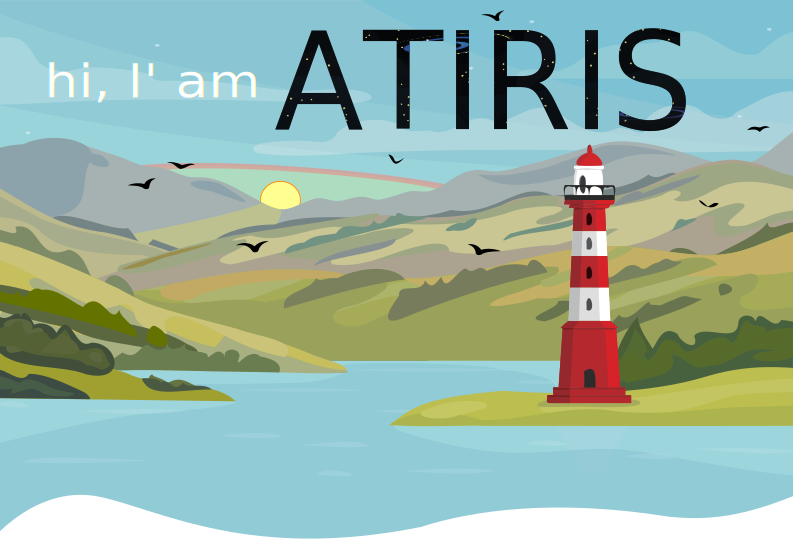

<!-- Badge: https://shields.io/category/size -->
<!-- Logo / Icon list: https://github.com/simple-icons/simple-icons/blob/develop/slugs.md -->
<!-- Icons list and colors: https://simpleicons.org/ -->

I am a general IT expert, specialized in the areas of database management, SQL query optimization, company software development and team management. After 15 years working in the IT sector I have strong technical **knowledge** as well as excellent interpersonal skills, enabling me to interact with a wide range of partners. I look forward to challenges that will push me forward and further improve my IT skills. I like to use my software knowledge for the benefit of colleagues and clients.

I try to see things positively and focus mainly on **solving** situations. I can work very well independently, but I also have experience in managing a small team. I don't like incomplete requests and I always try to teach the client to enter a request so that it is clear, replicable and complete.

I follow the principles of **simplifying** requirements and corrections until they cover the essence of the problem, removing unnecessary parts of processes, optimizing and simplifying the development cycle, speeding up development and automating activities.

Although I am trying to educate myself in software development and database management, **family** takes precedence over private projects. I like to visit the surrounding forests or use my bicycle to unwind from work tasks.

Below are the technologies and tools I worked with. That said, there are some projects where I've actually used them. However, the **speed** of advancement of technological development allows me to devote myself to only part of the technologies, primarily those that I use in private and work projects.

### What I use now

### What I worked with

![Java](https://img.shields.io/badge/Java-027db4?style=for-the-badge&logo=data:image/svg+xml;base64,PHN2ZyB4bWxucz0iaHR0cDovL3d3dy53My5vcmcvMjAwMC9zdmciIHZpZXdCb3g9IjAgMCAzODQgNTEyIj48cGF0aCBzdHJva2U9IndoaXRlIiBmaWxsPSJ3aGl0ZSIgZD0iTTI3Ny43NCAzMTIuOWM5LjgtNi43IDIzLjQtMTIuNSAyMy40LTEyLjVzLTM4LjcgNy03Ny4yIDEwLjJjLTQ3LjEgMy45LTk3LjcgNC43LTEyMy4xIDEuMy02MC4xLTggMzMtMzAuMSAzMy0zMC4xcy0zNi4xLTIuNC04MC42IDE5Yy01Mi41IDI1LjQgMTMwIDM3IDIyNC41IDEyLjF6bS04NS40LTMyLjFjLTE5LTQyLjctODMuMS04MC4yIDAtMTQ1LjhDMjk2IDUzLjIgMjQyLjg0IDAgMjQyLjg0IDBjMjEuNSA4NC41LTc1LjYgMTEwLjEtMTEwLjcgMTYyLjYtMjMuOSAzNS45IDExLjcgNzQuNCA2MC4yIDExOC4yem0xMTQuNi0xNzYuMmMuMSAwLTE3NS4yIDQzLjgtOTEuNSAxNDAuMiAyNC43IDI4LjQtNi41IDU0LTYuNSA1NHM2Mi43LTMyLjQgMzMuOS03Mi45Yy0yNi45LTM3LjgtNDcuNS01Ni42IDY0LjEtMTIxLjN6bS02LjEgMjcwLjVhMTIuMTkgMTIuMTkgMCAwIDEtMiAyLjZjMTI4LjMtMzMuNyA4MS4xLTExOC45IDE5LjgtOTcuM2ExNy4zMyAxNy4zMyAwIDAgMC04LjIgNi4zIDcwLjQ1IDcwLjQ1IDAgMCAxIDExLTNjMzEtNi41IDc1LjUgNDEuNS0yMC42IDkxLjR6TTM0OCA0MzcuNHMxNC41IDExLjktMTUuOSAyMS4yYy01Ny45IDE3LjUtMjQwLjggMjIuOC0yOTEuNi43LTE4LjMtNy45IDE2LTE5IDI2LjgtMjEuMyAxMS4yLTIuNCAxNy43LTIgMTcuNy0yLTIwLjMtMTQuMy0xMzEuMyAyOC4xLTU2LjQgNDAuMkMyMzIuODQgNTA5LjQgNDAxIDQ2MS4zIDM0OCA0MzcuNHpNMTI0LjQ0IDM5NmMtNzguNyAyMiA0Ny45IDY3LjQgMTQ4LjEgMjQuNWExODUuODkgMTg1Ljg5IDAgMCAxLTI4LjItMTMuOGMtNDQuNyA4LjUtNjUuNCA5LjEtMTA2IDQuNS0zMy41LTMuOC0xMy45LTE1LjItMTMuOS0xNS4yem0xNzkuOCA5Ny4yYy03OC43IDE0LjgtMTc1LjggMTMuMS0yMzMuMyAzLjYgMC0uMSAxMS44IDkuNyA3Mi40IDEzLjYgOTIuMiA1LjkgMjMzLjgtMy4zIDIzNy4xLTQ2LjkgMCAwLTYuNCAxNi41LTc2LjIgMjkuN3pNMjYwLjY0IDM1M2MtNTkuMiAxMS40LTkzLjUgMTEuMS0xMzYuOCA2LjYtMzMuNS0zLjUtMTEuNi0xOS43LTExLjYtMTkuNy04Ni44IDI4LjggNDguMiA2MS40IDE2OS41IDI1LjlhNjAuMzcgNjAuMzcgMCAwIDEtMjEuMS0xMi44eiIvPjwvc3ZnPg==&logoColor=white)

### Technologies and tools

  

    <h3>GitHub statistics (only public repos)</h3>
  

  

    
     
    
  

Contacts and links to social **networks** where you can occasionally find me (if I'm not programming or working).

&nbsp;

&nbsp;

&nbsp;

&nbsp;

<!--
&nbsp;

-->

I hope you are well and I wish you all the **best** 💖.
